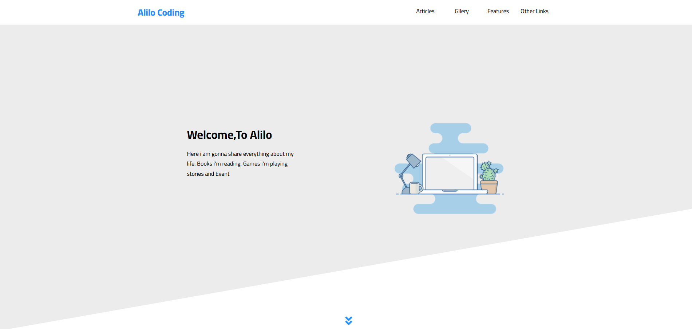
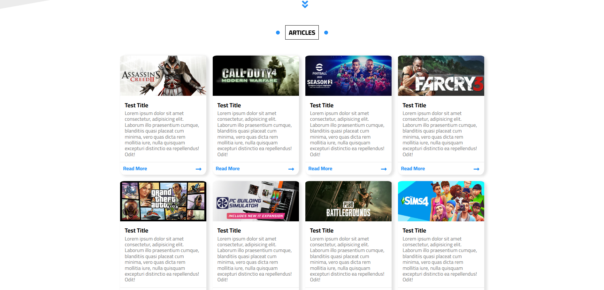
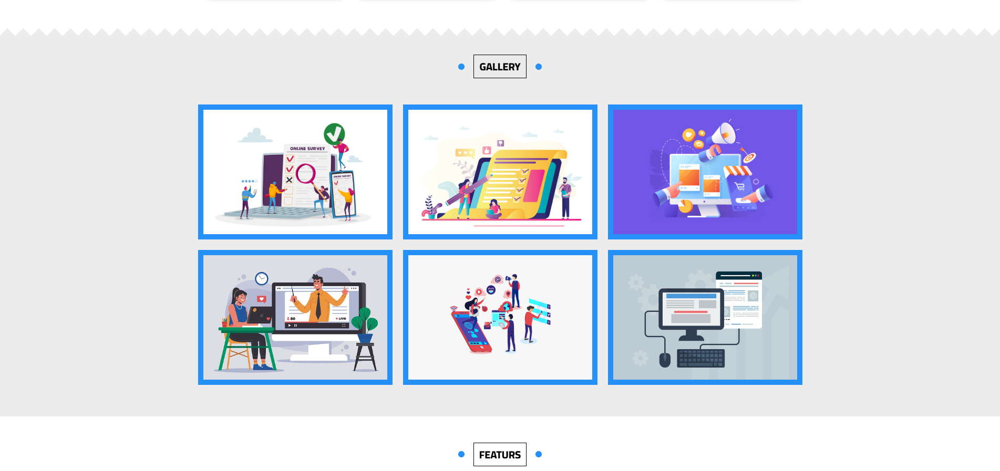
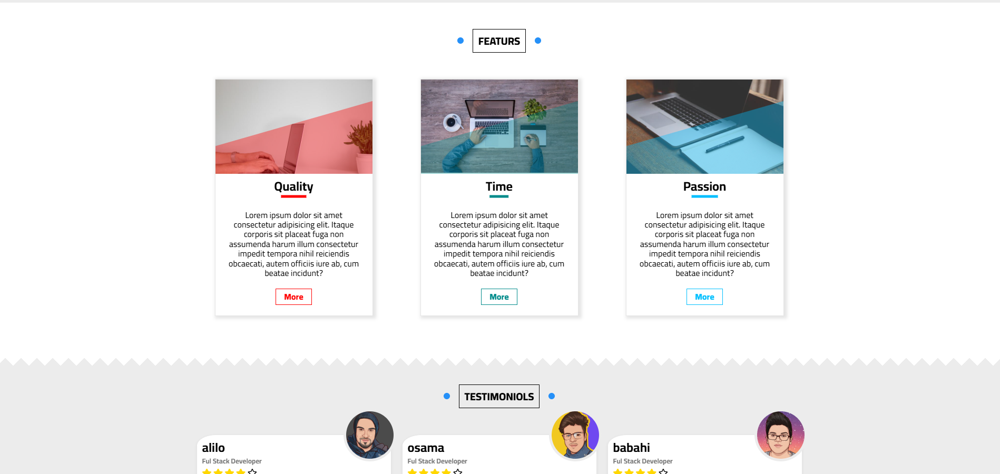
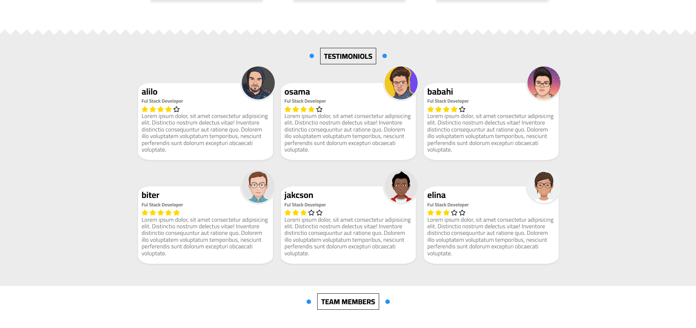
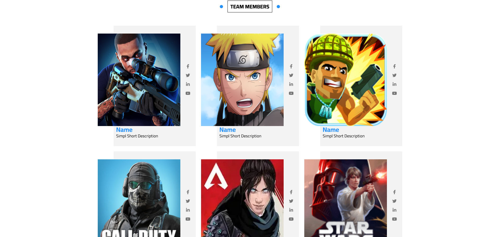
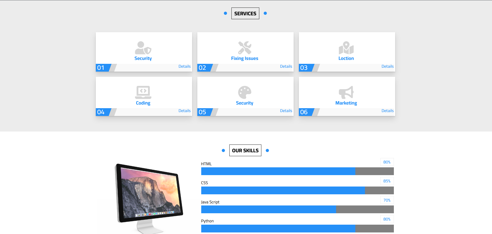
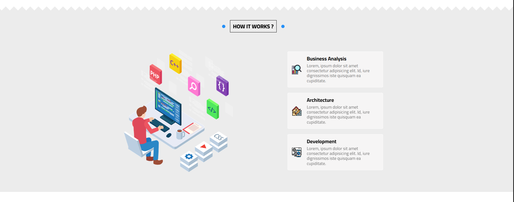
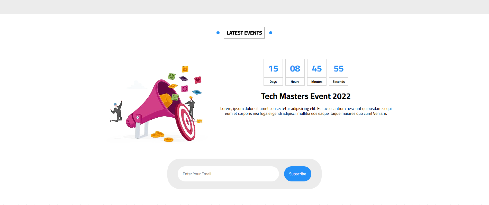

# Alilo Coding — Pure HTML & CSS Single-Page Template

🌐 Websites. A feature-rich, single-page website template built with **nothing but HTML5 and CSS3** — no JavaScript, no frameworks, no preprocessors. Every animation, every transition, every interactive effect is achieved using **pure CSS techniques** only.

---

## 📸 Preview

| | | |
|---|---|---|
|  |  |  |
|  |  |  |
|  |  |  |

---

## ✨ Features

- **Zero JavaScript** — every single interaction is handled by CSS alone
- **Single File** — the entire page lives in one `tump3.html` file
- **No Frameworks** — no Bootstrap, no Tailwind, no libraries of any kind
- **CSS Custom Properties** — global theming via 3 root variables
- **CSS-Only Dropdown Mega Menu** — triggered on `:hover` with an image + 10 sub-links in two columns
- **CSS-Only Background Slideshow** — 5 background images cycle automatically on the Discount section via `@keyframes`
- **CSS Auto-Counter** — Services cards are auto-numbered `01–06` using `counter-reset` and `counter-increment`
- **CSS-Only Spike Dividers** — decorative zigzag separators between sections using `linear-gradient` background patterns
- **Animated Section Headings** — `.mian-link` has two floating bullet dots that expand into a full color fill on hover
- **HTML5 Embedded Video** — native `<video>` player with a poster image (`VALORANT.mp4`)
- **CSS Progress Bars** — skill bars with percentage labels rendered from `data-percent` via the CSS `attr()` function
- **Self-hosted Font Awesome 5** — full icon set, no CDN required
- **Cairo Google Font** — Arabic-friendly typeface
- **Responsive Layout** — custom CSS media queries for mobile, tablet, and desktop

---

## 🎨 CSS Custom Properties

The entire template is controlled by **3 root variables**:

```css
:root {
  --main-color:       #2590f8;  /* Blue — links, accents, progress bars, borders */
  --section-backgrond: #ececec; /* Light grey — alternate section backgrounds     */
  --transform:        0.3s;     /* Global transition speed for all animations     */
}
```

To completely rebrand the template, change only `--main-color`.

---

## 🎞️ CSS Animations Reference

This project showcases **10+ named CSS `@keyframes` animations**, all written from scratch:

| Animation Name | Used In | Effect |
|---|---|---|
| `mov-img` | Hero / Landing | Hero illustration floats up and down infinitely |
| `mov-i` | Landing arrow | Down-arrow bounces to invite scrolling |
| `arrow` | Articles cards | "Read More" arrow slides left on card hover |
| `Circle` | Gallery | White circle burst expands from center on image hover |
| `Door-l` / `Door-r` | Features cards | CSS "door" opens to reveal card image via `skew()` |
| `mov-bults-left` / `mov-bults-right` | Section headings | Two bullet dots race inward and fill the heading bar |
| `fll` | Feature buttons | Button background floods in from the left on hover |
| `rset-back` | Discount section | 5 background images cycle every 20s automatically |

---

## 🧩 CSS-Only Techniques Showcase

### 1. Mega Dropdown Menu (CSS `:hover`)
```css
/* Hidden by default */
header .container>ul li .Other { display: none; }

/* Shown on hover of the last nav item */
header .container>ul>li:last-child:hover .Other { display: flex; }
```

### 2. Animated Section Headings (Two-bullet fill)
```css
/* Left bullet expands into full-width fill */
.mian-link::before {
  width: 10px; border-radius: 50%; left: -30px;
}
.mian-link:hover::before {
  animation: mov-bults-left 0.5s;
  width: 100%; border-radius: 0%;
}
```

### 3. Spike Dividers (CSS `linear-gradient` pattern)
```css
.spikes::before {
  background-image:
    linear-gradient(135deg, white 25%, transparent 25%),
    linear-gradient(225deg, white 25%, transparent 25%);
  background-size: 30px 30px;
}
```

### 4. CSS Auto-Counter on Services
```css
body { counter-reset: con-adad; }

.services .container .box .text::before {
  counter-increment: con-adad;
  content: "0" counter(con-adad);  /* Outputs: 01, 02, 03 … */
}
```

### 5. Background Image Slideshow (CSS `@keyframes`)
```css
@keyframes rset-back {
  0%   { background-image: url(../img/sunrise.jpg); }
  25%  { background-image: url(../img/norway.jpg);  }
  50%  { background-image: url(../img/sea.jpg);     }
  75%  { background-image: url(../img/rough-horn.jpg); }
  100% { background-image: url(../img/mountains.jpg); }
}
.discount .col:first-child {
  animation: rset-back 20s linear infinite;
}
```

### 6. CSS Progress Bar Percentage Labels (`attr()`)
```css
.our-skills .container ul li div::before {
  content: attr(data-percent);  /* Reads "80%" from the HTML attribute */
}
```

---

## 🗂️ Project Structure

```
tmplelet3/
├── tump3.html              # ← The entire website in one file
│
├── css/
│   ├── elzero.css          # Custom styles — all layout, animations, components
│   ├── all.min.css         # Font Awesome 5 (self-hosted)
│   └── normalize.css       # Cross-browser style reset
│
├── img/                    # All images used across sections
│   ├── interface.png       # Hero illustration
│   ├── imac.png            # Skills section decoration
│   ├── development.png     # How It Works illustration
│   ├── server.png,
│   │   servers.png,
│   │   servers (1).png     # Pricing plan tier icons
│   ├── sky.png             # Stats section background
│   ├── valorant.PNG        # Video player poster image
│   ├── discount.PNG        # Discount section illustration
│   ├── sunrise.jpg, norway.jpg,
│   │   sea.jpg, rough-horn.jpg,
│   │   mountains.jpg       # Cycling backgrounds for Discount section
│   ├── int.jpg, istockphoto*.jpg,
│   │   socia.png,
│   │   web-design .jpg     # Gallery + footer images
│   ├── asssassin creed 2.jpg,
│   │   call of duty modrn warfare 4.jpg,
│   │   efootball 2022.jpg, far cry 3.jpg,
│   │   gta.jpg, PC Building Simulator.jpg,
│   │   pubg.jpg, the sims.jpg      # Articles game covers
│   ├── hands.jpg, laptop.jpg,
│   │   desk.jpg            # Features section images
│   ├── a.png, b.png, o.png,
│   │   Bert.png, Verny.png,
│   │   Aniek.png           # Testimonials avatars
│   ├── unnamed.png, naruto.png,
│   │   Major-Mayhem.png, ...       # Team member images
│   ├── Business Analysis.png,
│   │   Architecture.png,
│   │   development1.png    # How it Works step icons
│   ├── add.png             # Events illustration
│   └── game.png            # Mega menu image
│
├── video/
│   └── VALORANT.mp4        # Embedded HTML5 video
│
├── webfonts/               # Self-hosted Font Awesome 5 font files
│   ├── fa-solid-900.*      # (.eot, .svg, .ttf, .woff, .woff2)
│   ├── fa-brands-400.*
│   └── fa-regular-400.*
│
└── imageGithub/            # Preview screenshots for README
    └── 1.png – 12.png
```

---

## 📄 Sections Overview

| # | Section | Key CSS Technique |
|---|---|---|
| 1 | **Header** | CSS-only mega dropdown (`display: none` → `flex` on `:hover`) |
| 2 | **Landing / Hero** | `height: 100vh`, skewed background via `::after`, floating image animation |
| 3 | **Articles** | CSS Grid `auto-fill`, card lift on hover, arrow animation |
| 4 | **Gallery** | CSS Grid, circle burst via `@keyframes Circle`, `matrix()` transform on hover |
| 5 | **Features** | CSS "door" open via `skew()` + `@keyframes Door-l/Door-r` |
| 6 | **Testimonials** | CSS Grid, gold star ratings via `.filled` class |
| 7 | **Team Members** | Hover greyscale (`filter: grayscale(100%)`), grey overlay via `::before` |
| 8 | **Services** | CSS auto-counter `01–06` via `counter-increment`, top border slide on hover |
| 9 | **Our Skills** | Progress bars, `attr(data-percent)` label via CSS `::before` |
| 10 | **How It Works** | 3-step boxes, full-overlay on hover via `::before` |
| 11 | **Latest Events** | Countdown number display, subscribe form with pill border-radius |
| 12 | **Pricing Plans** | CSS `::before` checkmark icons, "Most Popular" ribbon badge |
| 13 | **Top Videos** | HTML5 `<video>`, video list with `data-time` shown via CSS `::after` |
| 14 | **Stats** | Background image with 80% white overlay, vertical border on hover |
| 15 | **Discount** | CSS background slideshow (5 images), split-screen with contact form |
| 16 | **Footer** | Dark 4-column CSS Grid, social hover colors (Facebook/Twitter/YouTube) |

---

## 🚀 Getting Started

No setup, no install, no build step — just open the file:

```bash
# Clone the repository
git clone https://github.com/your-username/tmplelet3.git
cd tmplelet3

# macOS
open tump3.html

# Linux
xdg-open tump3.html

# Windows
start tump3.html
```

> **Tip:** For a better development experience, use the **Live Server** extension in VS Code so the browser auto-refreshes on save.

---

## 🌐 Responsive Breakpoints

The layout uses custom media queries defined directly in `elzero.css`:

| Breakpoint | Width | Behavior |
|---|---|---|
| Mobile | `max-width: 768px` | Stack columns, hide decorative images, center text |
| Tablet | `max-width: 992px` | Hide mega menu image, stack event layout |
| Desktop | `min-width: 992px` | Full side-by-side layout |
| Wide | `min-width: 1200px` | `container` max width `1170px` |

---

## 📝 Customization Guide

**Change the brand color:**
```css
/* css/elzero.css — line 2 */
:root {
  --main-color: #your-color;
}
```

**Add an article card:**
Copy any `.box` inside `.list-games` in `tump3.html` and update the ``, title, and paragraph.

**Add a gallery image:**
```html
<div class="imag">
  
</div>
```

**Change the discount background images:**
Edit the `@keyframes rset-back` block in `elzero.css` and replace the 5 `background-image` URLs.

**Change skill percentages:**
```html
<div data-percent="90%">
  <span style="width: 90%"></span>
</div>
```
Update both `data-percent` (for the CSS label) and `style="width:"` (for the bar width).

**Update pricing plans:**
Edit the three `.box` blocks inside `.pricing .container` — update the plan name, price, and `<ul>` feature list.

---

## 🛠️ Built With

| Technology | Purpose |
|---|---|
| HTML5 | Semantic page structure + embedded video |
| CSS3 | All styling, animations, layout, and interactions |
| [Font Awesome 5](https://fontawesome.com/) | Self-hosted icon library (.eot, .ttf, .woff, .woff2, .svg) |
| [Cairo](https://fonts.google.com/specimen/Cairo) | Arabic-friendly Google Font |
| [Normalize.css](https://necolas.github.io/normalize.css/) | Cross-browser style reset |

> ⚡ **No JavaScript. No frameworks. No preprocessors.** This project is intentionally built as a demonstration of how far pure HTML and CSS can go.

---

## 🌐 Browser Support

| Browser | Support |
|---|---|
| Chrome | ✅ Latest |
| Firefox | ✅ Latest |
| Safari | ✅ Latest |
| Edge | ✅ Latest |
| IE 11 | ⚠️ Partial (no CSS Custom Properties) |

---

## 📜 License

This project is open-source and available under the [MIT License](LICENSE).

---

## 🙋 Author

**Alilo Alaedine**
- GitHub: [@BoutefahaAlaeddine](https://github.comBoutefahaAlaeddine)

---

> ⭐ If you found this template useful, consider giving it a star on GitHub!
